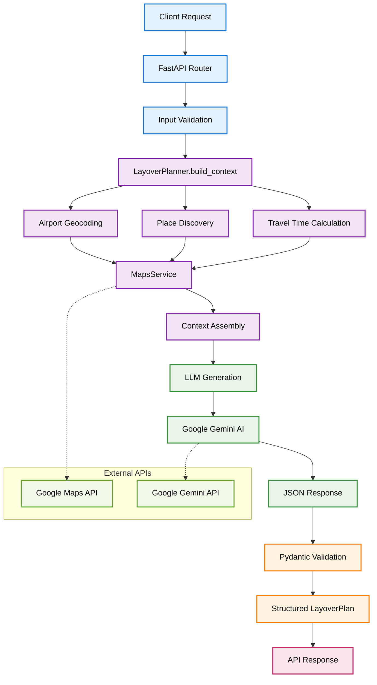

# Layover AI Agent

An intelligent layover planner API that generates structured layover plans for travelers during airport connections. The system integrates Google Maps and Google Gemini AI to provide smart recommendations for activities, dining, and sightseeing during layovers.

## 🏗️ Architecture

### Deployment Stack
- **Backend**: Google Cloud Platform (GCP)
- **Frontend**: Vercel
- **Reverse Proxy**: Caddy
- **APIs**: Google Maps + Google Gemini AI

### Tech Stack
- **FastAPI** - Modern Python web framework
- **Pydantic** - Data validation and settings management
- **Google Gemini AI** - LLM for generating structured layover plans
- **Google Maps API** - Location services and place discovery
- **Uvicorn** - ASGI server

## 🚀 Features

### Intelligent Time Management
- Dynamic buffer calculations based on layover duration
- Tiered approach: shorter layovers get smaller search radius
- Safety-first approach ensuring adequate return time

### Smart Place Discovery
- Multi-strategy search combining nearby places and text queries
- City-aware search terms (e.g., "souq in Riyadh", "heritage in Jeddah")
- Quality filtering by ratings and review counts
- Travel time validation to ensure reachability

### Structured AI Generation
- Schema-enforced JSON generation preventing hallucination
- Context-rich prompts with real place data
- Validation pipeline ensuring output correctness


## 🗺️ System Flow



### Google Maps APIs Used

#### 1. Geocoding API
- **Purpose**: Convert addresses to coordinates
- **Usage**: Converting airport names to lat/lng coordinates

#### 2. Reverse Geocoding API
- **Purpose**: Convert coordinates back to addresses
- **Usage**: Getting address components from coordinates

#### 3. Places Nearby Search API
- **Purpose**: Find places within radius or by distance ranking
- **Usage**: Finding nearby attractions, restaurants, malls around airports

#### 4. Places Text Search API
- **Purpose**: Search for places using text queries
- **Usage**: Searching for specific types like "souq in Riyadh"

#### 5. Places Details API
- **Purpose**: Get detailed information about specific places
- **Usage**: Getting comprehensive details for recommended stops

#### 6. Distance Matrix API
- **Purpose**: Calculate travel times and distances between points
- **Usage**: Calculating travel times from airport to each place

## 🛫 Airport Coverage

Currently supports 18 Saudi Arabian airports:

**Major Hubs:**
- RUH (King Khalid International, Riyadh)
- JED (King Abdulaziz International, Jeddah)
- DMM (King Fahd International, Dammam)

**Regional Airports:**
- MED (Medina), TIF (Taif), AHB (Abha)
- ELQ (Buraidah), YNB (Yanbu), HAS (Ha'il)
- EAM (Najran), AQI (Hafr Al Batin), GIZ (Jizan)
- ULH (Al-Ula), URY (Gurayat), TUU (Tabuk)
- WAE (Wadi ad-Dawasir), RAE (Arar), DWD (Dawadmi)

## ⚙️ Setup & Configuration

### Prerequisites
- Python 3.13+
- [uv](https://docs.astral.sh/uv/) - Fast Python package manager
- Google Maps API key with required services enabled
- Google Gemini API key

### Install uv (if not already installed)
```bash
# On macOS and Linux
curl -LsSf https://astral.sh/uv/install.sh | sh

# On Windows
powershell -c "irm https://astral.sh/uv/install.ps1 | iex"

# Or with pip
pip install uv

# Or with homebrew (macOS)
brew install uv
```

### Project Installation
```bash
# Clone repository
git clone <repository-url>
cd layover-ai-agent

# Create virtual environment and install dependencies
uv sync

# Activate virtual environment (optional - uv can run commands directly)
source .venv/bin/activate  # On Linux/macOS
# or
.venv\Scripts\activate     # On Windows
```

### Environment Variables
```bash
# Copy environment template
cp .env.example .env

# Edit .env with your API keys
GOOGLE_MAPS_API_KEY=your_maps_api_key
GOOGLE_GENAI_API_KEY=your_gemini_api_key
```

### Running the Application

#### Development Server
```bash
# Run with uv (recommended - no need to activate venv)
uv run uvicorn main:app --reload --host 0.0.0.0 --port 8000

# Or if venv is activated
uvicorn main:app --reload
```

#### Production Server
```bash
# Run with production settings
uv run uvicorn main:app --host 0.0.0.0 --port 8000 --workers 4

# Or with gunicorn
uv run gunicorn main:app -w 4 -k uvicorn.workers.UvicornWorker --bind 0.0.0.0:8000
```

### Development Commands


#### Adding Dependencies
```bash
# Add runtime dependencies
uv add fastapi uvicorn google-genai

# Add development dependencies
uv add --dev pytest black ruff mypy

# Update dependencies
uv sync --upgrade
```


