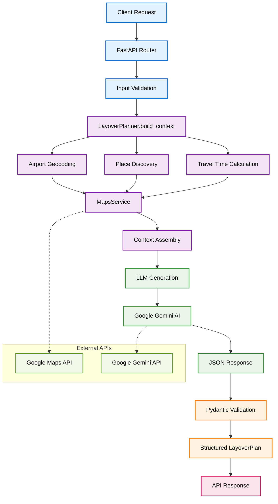

# Layover AI Agent - Technical Report

## 📋 Project Overview

The Layover AI Agent is an intelligent travel planning system that generates structured layover plans for travelers during airport connections. The system combines real-time location data from Google Maps with AI-powered recommendations from Google Gemini to create personalized, time-aware layover itineraries.

## 🏗️ System Architecture

### Deployment Infrastructure
- **Backend**: Google Cloud Platform (GCP)
- **Frontend**: Vercel
- **Reverse Proxy**: Caddy
- **External APIs**: Google Maps Platform + Google Gemini AI

### Architecture Pattern
- **Microservices**: Decoupled frontend and backend services
- **API-First**: RESTful API design with OpenAPI documentation
- **Serverless**: Scalable deployment on cloud platforms
- **Event-Driven**: Real-time data processing and AI generation

## 🔧 Backend Tech Stack

### Core Framework
- **FastAPI** - Modern Python web framework with automatic API documentation
- **Pydantic** - Data validation and settings management using Python type annotations
- **Uvicorn** - Lightning-fast ASGI server for production deployment

### AI & Machine Learning
- **Google Gemini AI** (google-genai >=1.32.0) - Large Language Model for structured JSON generation
- **Schema-Enforced Generation** - Prevents AI hallucination through strict output validation
- **Context-Rich Prompting** - Real-world data integration for accurate recommendations

### Location Intelligence
- **Google Maps Platform** (googlemaps >=4.10.0) - Comprehensive location services
- **Multi-API Integration** - Combines 6 different Google Maps APIs for complete coverage
- **Intelligent Caching** - Optimized API usage with batching and pagination

### Data Management
- **Pydantic Settings** (>=2.10.1) - Environment-based configuration management
- **Python Dotenv** (>=1.1.1) - Secure environment variable handling
- **Type Safety** - Full TypeScript-like type checking in Python

## ⚛️ Frontend Tech Stack

### Core Framework
- **React 18** - Modern React with hooks, functional components
- **TypeScript** - Full type safety and better developer experience
- **Vite** - Fast build tool and dev server

## 🗺️ System Data Flow

## 🔌 Third-Party Integrations

### Google Maps Platform APIs

#### 1. Geocoding API
- **Purpose**: Convert airport names to precise coordinates
- **Usage**: "King Khalid International Airport" → (24.9577, 46.6988)
- **Features**: Multi-language support, region biasing

#### 2. Reverse Geocoding API
- **Purpose**: Extract city and region information from coordinates
- **Usage**: Location context for AI prompt generation
- **Features**: Address component extraction, administrative levels

#### 3. Places Nearby Search API
- **Purpose**: Discover attractions within travel radius
- **Usage**: Find restaurants, malls, parks around airports
- **Features**: Ranking by prominence or distance, type filtering

#### 4. Places Text Search API
- **Purpose**: Semantic search for specific place types
- **Usage**: "heritage museum in Riyadh", "traditional souq"
- **Features**: Natural language queries, location-biased results

#### 5. Places Details API
- **Purpose**: Rich information about recommended locations
- **Usage**: Operating hours, ratings, contact information
- **Features**: Comprehensive place data, photo references

#### 6. Distance Matrix API
- **Purpose**: Real-time travel time calculations
- **Usage**: Airport to destination travel times with traffic
- **Features**: Multiple transport modes, traffic-aware routing

### Google Gemini AI Integration

#### Structured Generation
- **Schema Enforcement**: JSON output strictly follows Pydantic models
- **Context Integration**: Real place data prevents hallucination
- **Validation Pipeline**: Multi-layer validation ensures data integrity

#### Prompt Engineering
- **Context-Rich Prompts**: Include real place data, travel times, cultural info
- **Constraint Handling**: Time buffers, travel limitations, cultural considerations
- **Output Formatting**: Structured JSON with required fields and validation

## 🛫 Geographic Coverage

### Supported Airports (Saudi Arabia)
**Major International Hubs:**
- RUH (King Khalid International, Riyadh)
- JED (King Abdulaziz International, Jeddah)  
- DMM (King Fahd International, Dammam)

**Regional Airports:**
- MED (Prince Mohammad bin Abdulaziz, Medina)
- TIF (Taif Regional Airport)
- AHB (Abha International Airport)
- ELQ (Prince Nayef bin Abdulaziz, Buraidah)
- YNB (Yanbu Airport)
- HAS (Ha'il Regional Airport)
- EAM (Najran Domestic Airport)
- AQI (Al Qaisumah/Hafr Al Batin Airport)
- GIZ (Jizan Regional Airport)
- ULH (Prince Abdul Majeed bin Abdulaziz, Al-Ula)
- URY (Guriat Domestic Airport)
- TUU (Tabuk Regional Airport)
- WAE (Wadi Al Dawasir Domestic Airport)
- RAE (Arar Domestic Airport)
- DWD (Dawadmi Domestic Airport)
